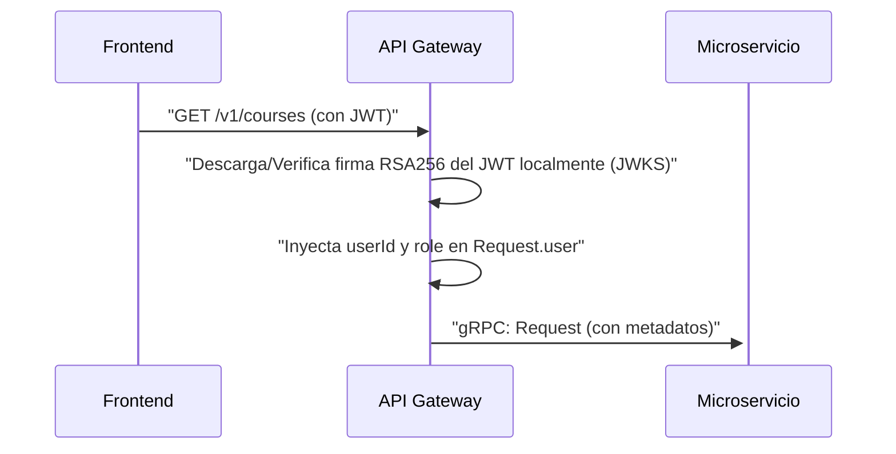
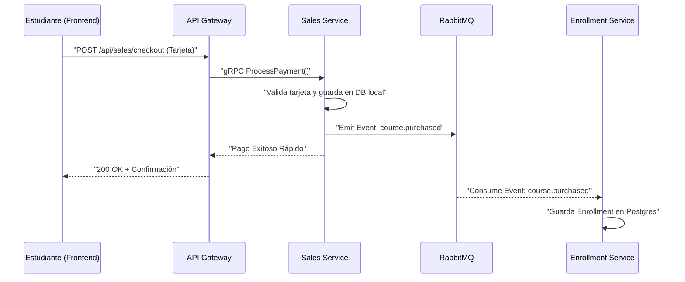
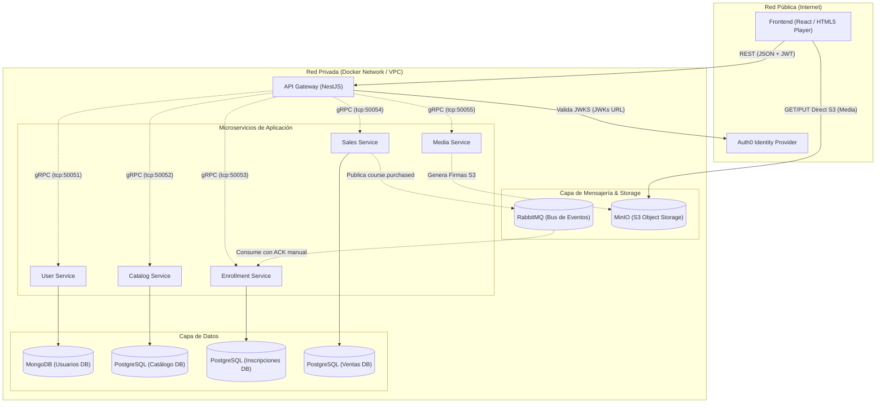

# Udemy Clone - Diseño Técnico (Migración a Microservicios)
ESTADO DEL DOCUMENTO: APROBADO / EN PRODUCCIÓN

---

## Resumen
Este proyecto es la evolución de la Plataforma de Aprendizaje en Línea Udemy Clone, migrando desde un enfoque monolítico hacia una arquitectura basada en **Microservicios**. El objetivo principal es lograr escalabilidad independiente, resiliencia y separación de dominios. Los usuarios interactúan a través de un **API Gateway** (REST), el cual se comunica internamente con un clúster de microservicios distribuidos utilizando **gRPC** para garantizar la máxima velocidad y eficiencia en la red interna.

## Supuestos
- La infraestructura permite el despliegue de múltiples servicios aislados (Docker/Kubernetes).
- El sistema de base de datos se ha descentralizado: se utilizan bases de datos específicas según el dominio (PostgreSQL para relaciones fuertes y MongoDB).
- Los archivos multimedia (videos, recursos) se manejan a través del servicio de medios (almacenamiento en disco local / metadatos en base de datos) para desarrollo local.
- Se utiliza Auth0 como proveedor de identidad OIDC centralizado.

## Alcance de la Migración
**La migración a Microservicios incluye:**
- Separación estricta de dominios: Autenticación, Catálogo, Inscripciones, Multimedia y Ventas (Simulación).
- Comunicación interna síncrona mediante **gRPC** y Protocol Buffers para consultas directas.
- Arquitectura orientada a eventos (Event-Driven) con **RabbitMQ** para procesos asíncronos (ej. Inscripciones tras compra).
- Base de datos por servicio (Database-per-service pattern) garantizando bajo acoplamiento.
- Simulador del flujo de compras en un servicio desacoplado.
- Manejo de archivos *Stateless* utilizando MinIO (S3 compatible) y URLs pre-firmadas.

**Fuera del alcance (Fase actual):**
- Despliegue distribuido en nube pública (actualmente centralizado en `docker-compose`).
- Implementación del Patrón Transactional Outbox: Actualmente, el Sales Service hace una doble escritura (PostgreSQL + RabbitMQ). La implementación de una tabla Outbox para garantizar la entrega atómica de eventos en escenarios de caída abrupta del contenedor queda diferida para una fase posterior.
- Escalado Horizontal del API Gateway: En una fase futura, el API Gateway se replicará horizontalmente en múltiples instancias detrás de un Balanceador de Carga (como NGINX o un ALB en AWS) para mitigar el punto único de falla (SPOF) y garantizar la Alta Disponibilidad (HA).

---

## 1. Requerimientos

### 1.1 Requerimientos Funcionales
1. **API Gateway Único:** Todas las peticiones del frontend (React) deben pasar por un único punto de entrada (API Gateway), el cual enruta y orquesta la solicitud hacia el microservicio correspondiente usando gRPC.
2. **Gestión de Cursos (Catalog):** Los instructores deben poder crear cursos, módulos y lecciones (con sus respectivas descripciones), almacenados de forma relacional y estructurada.
3. **Multimedia y Streaming (Media):** Soporte para la subida de archivos de video (MP4) de manera escalable, generando URLs de subida pre-firmadas hacia un S3 (MinIO local) para que los archivos no saturen el microservicio.
4. **Carrito de Compras y Pagos (Sales):** Los estudiantes deben poder agregar cursos a un carrito persistente y simular un flujo completo de compra procesando datos de tarjeta (simulados). Al finalizar, el sistema debe emitir un evento de compra exitosa.
5. **Inscripciones y Progreso (Enrollment):** Tras concretar una compra exitosa (escuchando el evento asíncrono), el sistema debe registrar el acceso permanente a los cursos y realizar un seguimiento del progreso.

### 1.2 Requerimientos No Funcionales
1. **Baja Latencia Interna:** La comunicación entre el API Gateway y los microservicios se realiza utilizando **gRPC** (binario sobre HTTP/2) para minimizar la latencia.
2. **Descentralización de Datos (Polyglot Persistence):** Uso de la base de datos más adecuada para cada servicio (PostgreSQL para esquemas relacionales complejos como Catálogo, y bases de datos o esquemas apartados para Ventas y Autenticación).
3. **Aislamiento de Fallos y Asincronía:** El desacoplamiento garantiza que la falla en un dominio de negocio no detenga por completo la plataforma. La coreografía de eventos vía RabbitMQ permite resiliencia si un microservicio consumidor cae.
4. **Contratos Estrictos (Protobuf):** Todos los microservicios definen y comparten sus interfaces síncronas usando archivos `.proto` centralizados.

---

## 2. Entidades y Microservicios Principales

1. **`api-gateway` (NestJS):** Expone endpoints REST/HTTP al Frontend, realiza validaciones básicas y actúa como cliente gRPC hacia la capa de microservicios.
2. **`user-service`**: Gestiona la interacción central con Auth0, y mantiene un caché / sincronización de los perfiles de usuario y roles.
3. **`catalog-service` (PostgreSQL + Prisma):** Administra las entidades `Course`, `Module` y `Lesson` (incluyendo sus descripciones).
4. **`enrollment-service` (PostgreSQL + Prisma):** Escucha eventos de RabbitMQ para crear inscripciones (`Enrollment`) y administra el progreso vía gRPC.
5. **`sales-service` (PostgreSQL + Prisma + RabbitMQ):** Controla el flujo transaccional de compra y emite el evento `course.purchased` vía message broker.
6. **`media-service` (AWS SDK S3):** Servicio *Stateless* que genera `Presigned URLs` contra MinIO para subidas y descargas directas del cliente al storage.

---

## 3. Interfaces y Contratos (gRPC + REST)

- **Frontend -> API Gateway:** Comunicación tradicional REST (JSON). La identidad se valida en el API Gateway mediante middlewares y JWT (`Authorization: Bearer <token>`).
- **API Gateway -> Microservicios:** Protocolo **gRPC**. Esto significa que las peticiones HTTP REST se mapean a peticiones de llamadas a procedimientos remotos.

**Fragmento de Contrato gRPC (`catalog.proto`):**
```proto
syntax = "proto3";
package catalog;

service CatalogService {
  rpc CreateCourse (CreateCourseRequest) returns (Course);
  rpc UpdateModule (UpdateModuleRequest) returns (Module);
  rpc UpdateLesson (UpdateLessonRequest) returns (Lesson);
}

message CreateCourseRequest {
  string title = 1;
  string instructorId = 2;
  double price = 3;
  string description = 4;
}

message Course {
  string id = 1;
  string title = 2;
  string instructorId = 3;
  double price = 4;
  string description = 5;
}

message UpdateModuleRequest {
  string moduleId = 1;
  string title = 2;
  string description = 3;
}

message Module {
  string id = 1;
  string courseId = 2;
  string title = 3;
  string description = 4;
}

message UpdateLessonRequest {
  string lessonId = 1;
  string title = 2;
  string description = 3;
}

message Lesson {
  string id = 1;
  string moduleId = 2;
  string title = 3;
  string videoUrl = 4;
  string status = 5;
  string description = 6;
}
```

---

## 4. Flujo de Datos

**Flujo End-to-End de Autenticación y API Gateway:**


**Flujo Transaccional de Compra Simultánea (Saga Simplificada con RabbitMQ):**


---

## 5. Diseño de Alto Nivel de Microservicios



---

## 6. Inmersiones Profundas

### 6.1 Diseño de Base de Datos y Modelado (Prisma ORM)
En lugar de una única base de datos masiva, adoptamos **Database-per-service**:

**`catalog-service` (PostgreSQL)**
```prisma
model Course {
  id           String   @id @default(uuid())
  title        String
  description  String   @default("")
  instructorId String
  price        Float
  modules      Module[]
}

model Module {
  id          String   @id @default(uuid())
  courseId    String
  title       String
  description String   @default("")
  position    Int
  course      Course   @relation(fields: [courseId], references: [id], onDelete: Cascade)
  lessons     Lesson[]
}

model Lesson {
  id          String     @id @default(uuid())
  moduleId    String
  title       String
  description String     @default("")
  videoUrl    String?
  status      String     @default("Pending")
  position    Int
  module      Module     @relation(fields: [moduleId], references: [id], onDelete: Cascade)
  resources   Resource[]
}

model Resource {
  id       String @id @default(uuid())
  lessonId String
  title    String
  fileUrl  String
  fileType String
  lesson   Lesson @relation(fields: [lessonId], references: [id], onDelete: Cascade)
}
```

**`enrollment-service` (PostgreSQL)**
```prisma
model Enrollment {
  id               String   @id @default(uuid())
  courseId         String
  userId           String
  amountPaid       Float    @default(0)
  progress         Float    @default(0)
  completedLessons String[] @default([])
  createdAt        DateTime @default(now())

  @@unique([userId, courseId])
}
```

### 6.2 Almacenamiento y Streaming de Medios (MinIO Stateless)
- **Flujo de Carga (Upload mediante URLs Pre-firmadas):** Para evitar cuellos de botella en el backend, se implementa una delegación de carga estructurada respetando que el Frontend jamás tenga visibilidad directa sobre la red interna de microservicios:
  1. **Solicitud:** El Frontend (React) solicita una URL de subida pre-firmada enviando una petición REST HTTP al **API Gateway**.
  2. **Resolución Interna:** El **API Gateway** actúa como intermediario seguro y solicita la generación de la firma al **media-service** a través de una llamada síncrona **gRPC**.
  3. **Firma:** El **media-service**, interactuando de forma stateless con el bucket S3 (MinIO) mediante `@aws-sdk/client-s3`, genera la URL pre-firmada (con tiempo limitado de expiración) y la devuelve al **API Gateway** vía gRPC.
  4. **Retorno:** El **API Gateway** retorna la URL pre-firmada final al Frontend como respuesta REST.
  5. **Carga Directa:** El Frontend realiza una petición HTTP `PUT` directamente al Object Storage (**MinIO** en desarrollo local, o S3/CDN en producción) utilizando la URL obtenida.
- **Regla de Oro:** El Frontend únicamente conoce y tiene contacto público con el **API Gateway** (para operaciones de negocio) y con **MinIO/S3** (para transferencia masiva de archivos). Los microservicios internos permanecen 100% aislados en la red interna de Docker.
- **Ventaja Tecnológica:** Se elimina por completo el uso de memoria RAM del servidor backend y la saturación del Event Loop en Node.js durante la transferencia de archivos de video pesados (MP4).

### 6.3 Orquestación con Docker Compose
Toda la infraestructura se agrupa mediante `docker-compose.yml`, levantando:
- **Bases de datos**: PostgreSQL, MongoDB.
- **Herramientas**: pgAdmin, Mongo Express.
- **Message Broker**: RabbitMQ (Management UI en 15672).
- **Object Storage**: MinIO (Console en 9001) con un script automático para crear el bucket `udemy-media`.

### 6.4 Generación de Código TypeScript desde Protos
Para brindar tipado estático estricto en el desarrollo y evitar el uso de tipados laxos (`any`), se ha configurado la compilación de contratos de comunicación utilizando la herramienta oficial:
- **Herramienta**: Usamos el compilador oficial de gRPC (`protoc` versión 25.9) y el plugin `ts-proto` (versión 2.11.8) configurado específicamente para NestJS (`nestJs=true`).
- **Ejecución**: Se ejecuta el comando `npm run generate` desde el directorio `grpc-contracts`.

### 6.5 Arquitectura Event-Driven (RabbitMQ)
- El proceso de compras dejó de ser un cuello de botella síncrono que bloquea la respuesta al cliente.
- El **Sales Service** persiste su transacción local e inmediatamente utiliza un `ClientProxy` (transporte AMQP) para despachar un evento asíncrono `course.purchased`.
- El **Enrollment Service** está configurado en un modelo de microservicio híbrido (gRPC + RabbitMQ). Al atrapar el evento con el decorador `@EventPattern('course.purchased')`, procesa y persiste asíncronamente el acceso del estudiante al curso.
- **Garantía de Entrega (At-Least-Once):** La mensajería con RabbitMQ utiliza **Colas Durables (Durable Queues)** y **Acuses de Recibo Manuales (Manual ACKs)** configurando `noAck: false`. Esto asegura que si el `enrollment-service` consume el mensaje pero se apaga o sufre una caída antes de confirmar la persistencia en Postgres, RabbitMQ detectará la desconexión del canal y re-encolará (re-queue) automáticamente el evento, impidiendo cualquier pérdida de inscripciones.
- **Manejo de Fallos (Compensación):** Si el `Enrollment Service` falla al persistir la inscripción (ej. violación de integridad en PostgreSQL), emitirá un evento compensatorio `enrollment.failed`. El `Sales Service` escuchará este evento para revertir el estado de la transacción a `REFUNDED` y notificar al usuario, garantizando la consistencia eventual.

### 6.6 Validación Local de Autenticación con JWKS (Stateless)
- **El Problema Original:** El API Gateway realizaba una llamada gRPC sincrónica hacia el `user-service` para verificar cada token JWT entrante, lo que sobrecargaba la red y creaba un punto único de falla acoplado para cada request HTTP.
- **La Solución Implementada:**
  1. El API Gateway utiliza `@nestjs/passport` y `jwks-rsa` para descargar y cachear de forma asíncrona la lista de llaves públicas del emisor Auth0 (`jwksUri`).
  2. La validación de la firma `RS256` y expiración del JWT ocurre 100% en memoria en el API Gateway, liberando al `user-service` de consultas recurrentes.
  3. El payload decodificado se asocia automáticamente a la petición (`request.user`), haciendo disponibles los campos `userId` y `role` para los controladores protegidos.
- **Seguridad Dinámica:** La configuración de dominio y audiencia se realiza exclusivamente mediante variables de entorno (`AUTH0_ISSUER_URL`, `AUTH0_AUDIENCE`) leídas dinámicamente con el `ConfigService` de NestJS.

### 6.7 Resolución del Problema N+1 (API Composition)
- **El Problema Original:** Al consultar la lista de cursos (`catalog-service`), el backend solo guardaba y retornaba el `instructorId` de cada curso. Para mostrar el nombre y avatar del instructor, el frontend tendría que hacer $N$ peticiones adicionales o el Gateway realizar $N$ llamadas individuales gRPC a `user-service`, provocando un problema de consultas N+1 en red.
- **La Solución Implementada (Composición en Memoria):**
  1. **Llamada de Catálogo:** El API Gateway obtiene todos los cursos en una sola petición gRPC masiva.
  2. **Consolidación de IDs:** Filtra y extrae los `instructorId`s de manera única utilizando un `Set` de JavaScript en memoria para evitar llamadas redundantes de un mismo instructor.
  3. **Lote gRPC:** Llama a un único método gRPC masivo `userService.GetUsersByIds({ userIds })` pasando el arreglo simplificado de IDs.
  4. **Unión de Datos:** Transforma la respuesta en un diccionario/hash-map en memoria (`instructorId` -> `{ name, avatarUrl }`) y compone cada curso insertándole su respectivo objeto `instructor` antes de retornar el JSON consolidado.

---

## 7. Pruebas y Verificación

**Para comprobar el funcionamiento del Event-Driven y Stateless S3:**
1. **Validar Contenedores:** Asegurarse de que `docker ps` muestra a `udemy-rabbitmq` y `udemy-minio` corriendo.
2. **Dashboard RabbitMQ:** Navegar a [http://localhost:15672](http://localhost:15672) (guest/guest). Al realizar un Checkout simulado en Ventas, se podrá visualizar el tráfico entrando a la `sales_queue` e instantáneamente siendo consumido.
3. **Dashboard MinIO:** Navegar a [http://localhost:9001](http://localhost:9001) (admin/password123). Al solicitar subida de contenido se generará contenido en el bucket `udemy-media`.
4. **Logs:** Revisar la consola del `enrollment-service` que imprimirá "Event received: course.purchased" indicando el enganche exitoso del bus de eventos.

---

## 8. Interesados y Contactos
- Equipo de Desarrollo Frontend
- Equipo de Operaciones / DevOps (Despliegue distribuido de contenedores)
- Arquitecto de Software
